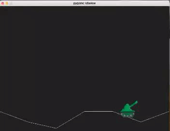
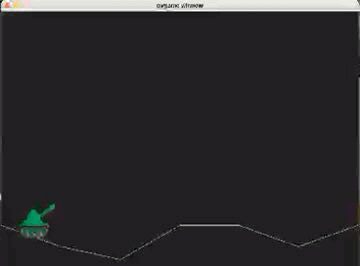
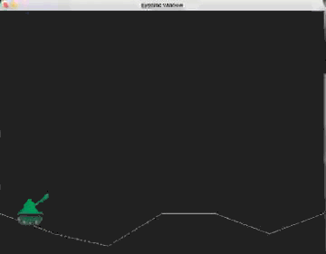
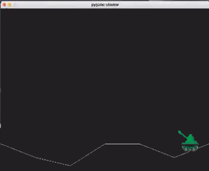
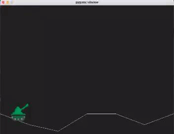

# tanker-soul

This is a battle tank game where you have a lot of worlds to play. 
to try this game you must download the folder and run main.py (you should have installed pygame)

## worlds
One world is modeling by a vector of positions, where each component is the height of the ground, changing the vector will change the world.
The floor was built using the linear equation of a straight applied to adjacents points in the world vector.

## tank
Each tank has its own velocity, health and its own (and maybe) unique way of shotting.
shotting can be doing with diferents angles.

## projectile
It was implemented with the equation of projectile motion.
Each projectile has a certain amount of damage when this impacts another tank.

## movements

rigth arrow -> move to the rigth

left arrow -> move to the left

up arrow -> increase the angle of the cannon tank

down arrow -> decrease the angle of the cannon tank

space -> shot

## screenshots

  

